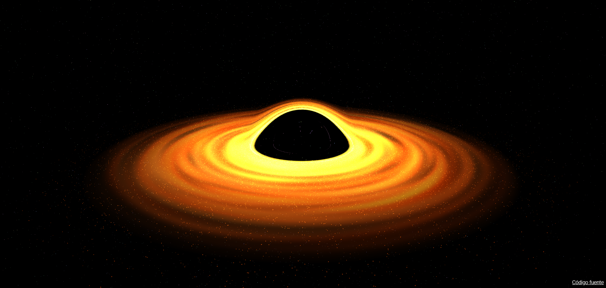

# WebGL Black Hole Simulation

A stunning, real-time WebGL simulation of a black hole, showcasing relativistic gravitational lensing (Einstein Ring), a dynamic accretion disc, and a dense field of custom shader-driven particles. Built with Three.js, GLSL, and Vite.



---

## 🌌 Project Overview

This project simulates the visual effects of a black hole in real-time using advanced WebGL techniques. Instead of a standard 3D mesh, the black hole's gravitational lensing (light bending) is computed dynamically through a custom screen-space post-processing shader. The composition pipeline splits the scene into regular space rendering and a gravitational distortion map, merging them to create a realistic cosmic distortion.

---

## ✨ Features

- **Relativistic Gravitational Lensing:** Real-time screen-space coordinate deflection based on a custom distortion mask shader to simulate the bending of light around the event horizon.
- **Procedural Accretion Disc:** A custom-engineered cylinder geometry featuring dynamic HSL color mappings and a real-time procedural noise texture.
- **Accretion Flow Particles:** 50,000 GPU-accelerated particles swirling dynamically towards the event horizon.
- **Starfield Background:** 50,000 volumetric star particles positioned on a spherical shell with randomized HSL coloration.
- **Chromatic Aberration:** Post-processing RGB Shift effect applied around the gravitational distortion boundaries.
- **Interactive Debug Panel:** Real-time controls powered by `lil-gui` to customize colors, exposure, and tone mappings on the fly.
- **Modular Architecture:** Structured with modular ES6 classes managing the Three.js lifecycle (`Renderer`, `Camera`, `World`, `Time`, `Sizes`).

---

## 🏗️ Architecture & Core Components

```
sources/
├── Experience/
│   ├── Debug/                 # Debug UI and Stats modules
│   ├── Materials/             # Custom RawShaderMaterial definitions
│   ├── shaders/               # GLSL 3.0 vertex & fragment shaders
│   ├── Utils/                 # Resize, Time and Event listeners
│   ├── BlackHole.js           # Core Black Hole element (disc, accretion particles, distortion plane)
│   ├── Stars.js               # Starfield system
│   ├── Camera.js              # Perspective camera wrapper
│   ├── Renderer.js            # Custom multi-pass compositor & post-processing renderer
│   ├── World.js               # Space scene coordinator
│   └── Experience.js          # Engine entry point & main update loop
├── index.html
└── index.js
```

### Rendering Pipeline:
1. **Space Pass:** Renders the background stars, accretion disc, and black hole particles into a high-resolution space render target.
2. **Distortion Pass:** Renders a special black-and-white distortion texture mapping the gravitational pull.
3. **Composition Pass (Final):** A full-screen fragment shader blends the space pass and distortion pass, deflecting texture coordinates towards the black hole's screen position and applying an RGB chromatic shift.

---

## 🚀 Setup & Installation

### Prerequisites
Make sure you have [Node.js](https://nodejs.org/en/download/) installed (v16+ recommended).

### 1. Install Dependencies
Run the following command in the project root folder to install all required packages:
```bash
npm install
```

### 2. Run Local Development Server
Start the local server at [http://localhost:3000](http://localhost:3000) (or the port specified in terminal):
```bash
npm run dev
```

### 3. Build for Production
To compile and optimize the project into the `dist/` folder:
```bash
npm run build
```

---

## 🗺️ Roadmap & Future Enhancements

- [x] **RGBShift:** Completed post-processing chromatic aberration.
- [ ] **Vignette:** Cinematic border darkening in the final composition shader.
- [ ] **Vibration:** Camera shaking and gravitational shockwaves based on noise algorithms.
- [ ] **Better lighting:** Realistic lighting integration between the accretion disc and surrounding models.
- [ ] **Timeline & Cinematic Controls:** Storytelling transitions using timing libraries.
- [ ] **Base & Textured Model:** Complete integration of the spaceship model inside the simulation (`Spaceship.js`).
- [ ] **Intro / Outro:** Interactive entry/exit animations for a game-like interactive web experience.